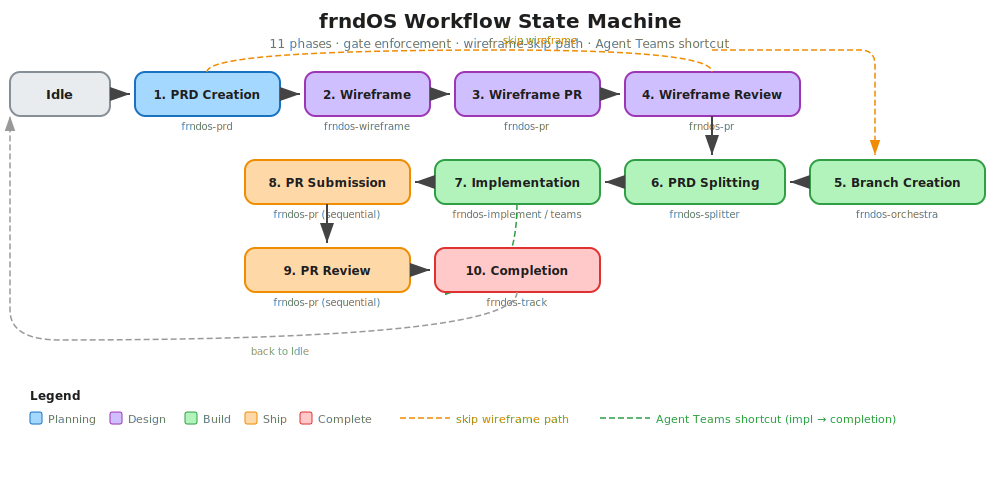
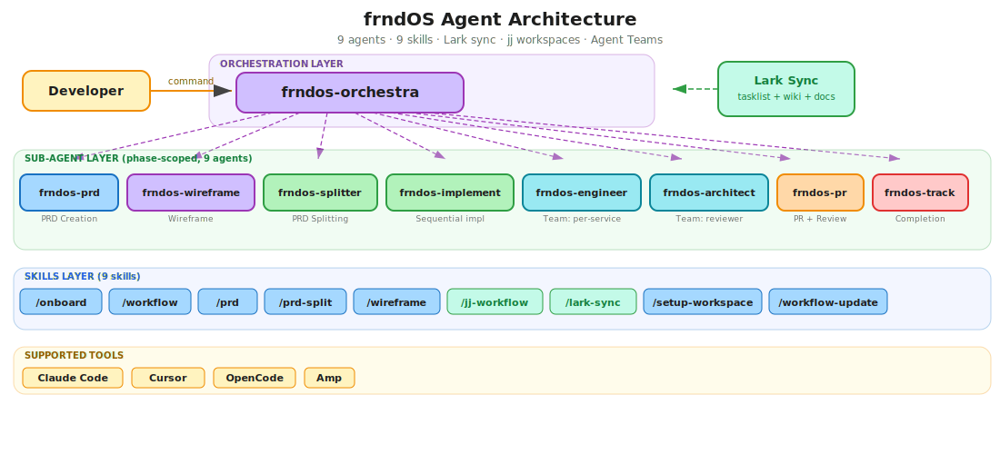

# frndOS Agentic Workflows

> **Maintainer:** Alva Intelligence Engineering

---

## For LLM Agents — Read This First

> **If you are an LLM agent and a user has pointed you at this repository, follow the instructions below.**
>
> **CRITICAL: Do NOT clone this repository.** This repo is an instruction set, not a project to clone. The workspace directory should remain a plain folder (NOT a git repo). You install files by running the bootstrap script below, which downloads only the needed files. NEVER run `git clone` with this repo URL into the user's workspace.

### Step 1: Welcome the user

Display this welcome message:

```
Welcome to frndOS Agentic Workflows!

frndOS is a multi-service platform built by Alva Intelligence. This system sets up
your development workspace and guides you through a structured feature development
workflow — from PRD creation to wireframing, implementation, and PR submission.

What gets installed:
  - 10 phase-scoped AI agents (orchestra, prd, wireframe, splitter, implement, engineer, architect, pr, track)
  - 6 skills (/onboard, /workflow, /workflow-update, /prd, /prd-split, /wireframe)
  - An 11-phase workflow state machine with gate enforcement
  - Agent Teams support — parallel per-service engineers + architect (Claude Code)
  - Auto-updating instruction system (stays in sync with team changes)
  - Templates for PRDs, service PRDs, track files, and PRs

Supported tools: Claude Code, Cursor, OpenCode (and any tool supporting SKILL.md)
```

### Step 2: Ask for confirmation

Use your **ask tool** (Claude Code: `AskUserQuestion`, Cursor: ask tool, OpenCode: question tool):

> "Would you like to set up frndOS and start the agentic workflow?"
> - Yes, set it up
> - No, not now

**Do NOT proceed without explicit confirmation.** The ask tool blocks until the user responds.

### Step 3: If yes — run the bootstrap (DO NOT CLONE)

**Do NOT run `git clone`.** Instead, run the bootstrap script which downloads individual files into the current directory:

```bash
curl -sL "https://raw.githubusercontent.com/alva-intelligence/agentic-workflows/main/scripts/update-check.sh" \
  -o /tmp/aw-update-check.sh && bash /tmp/aw-update-check.sh --bootstrap
```

This downloads agents, skills, fragments, templates, and workflow configs into `.agentic-workflows/`, `.agents/`, and generates `AGENTS.md`. The workspace directory stays a plain folder — NOT a git repo.

### Step 4: After bootstrap — start onboarding

1. Read the generated `AGENTS.md` file in the workspace root
2. Follow the **Session Start Protocol** — it detects this is a fresh workspace
3. Use your **ask tool** to ask: "Would you like to start onboarding now?"
4. If yes: Read `.agents/skills/onboard/SKILL.md` and execute the onboarding directly in this session
5. Onboarding walks through: GitHub access, service selection, cloning, dependencies, .env files, database, editor config, and MCP setup

### Flow summary

```
User points agent at this repo
  → Agent reads README.md (this file)
  → Agent shows welcome message
  → Agent asks: "Ready to set up?" (yes/no)
  → If yes: bootstrap → AGENTS.md → asks "Start onboarding now?"
  → If yes: reads SKILL.md directly → runs onboarding in same session
  → After onboarding: /workflow start <feature-slug>
```

---

## For Humans — Repository Reference

This repo is the single source of truth for frndOS AI agent instructions. It is NOT cloned into workspaces — instead, individual files are downloaded and cached locally via the auto-update mechanism.

### See it work

A complete feature lifecycle — from idea to merged PRs. The agent handles everything; you steer.

```
You:    /workflow start brand-health-dashboard
Agent:  Feature "brand-health-dashboard" started. Phase: prd_creation.
        [delegates to frndos-prd]

You:    Here's the Lark doc: https://lark.com/doc/...
        The dashboard should show brand sentiment over time,
        top mentions, and alert thresholds.
Agent:  [reads Lark doc via MCP, asks clarifying questions]
        [drafts PRD with objectives, user stories, acceptance criteria]
        [asks you to review before saving]
You:    Looks good, but add a comparison view for multiple brands.
Agent:  [updates PRD, saves to docs/prd/brand-health-dashboard.md]
        PRD created. → Phase: wireframe.

You:    /workflow next
Agent:  [delegates to frndos-wireframe]
        [reads PRD, scans existing frndos components, studies previous wireframes]
        [presents plan: main dashboard page + detail sub-page + comparison view]
You:    Go ahead.
Agent:  [builds production-quality static frontend — real components, real interactions]
        [creates wireframes/brand-health-dashboard/dashboard/ with page.tsx,
         components/, [brandId]/page.tsx, compare/page.tsx, metadata.json]
        [commits on wireframe/claude/vc-brand-health-dashboard branch]
        Done. → Phase: wireframe_pr.

Agent:  [delegates to frndos-pr]
        [creates PR targeting develop, fills template, tags FE owners]
        PR: github.com/alva-intelligence/frnd-web/pull/87
        → Phase: wireframe_review. Waiting for FE owners + Jeff approval.

You:    Jeff approved. FE owners merged.
Agent:  [verifies PR merged on GitHub]
        → Phase: branch_creation.
        [checkouts develop, verifies wireframe on develop, creates feature branch]
        Branch: feature/claude/vc-brand-health-dashboard
        → Phase: prd_splitting.

Agent:  [delegates to frndos-splitter]
        [reads main PRD, determines affected services: api + web]
        [generates api/docs/prd/brand-health-dashboard.md — endpoints, migrations, models]
        [generates web/docs/prd/brand-health-dashboard.md — pages, state, API integration]
        Service PRDs created. → Phase: implementation.
```

**From here, the path splits based on your session mode:**

```
━━━ Agent Session (sequential) ━━━━━━━━━━━━━━━━━━━━━━━━━━━━━━━━━━━━━━━━━━━━━━

Agent:  [delegates to frndos-implement]
        [reads both service PRDs, presents implementation plan]
You:    Approved.
Agent:  [implements API: migrations, models, controllers, tests]
        [implements Web: wires wireframe to real API, state management, error handling]
        [self-reviews, commits per task]
        Implementation complete. → Phase: pr_submission.

Agent:  [delegates to frndos-pr]
        [creates PR per service targeting develop/development]
        API PR: github.com/.../pull/201
        Web PR: github.com/.../pull/88
        → Phase: pr_review.

You:    API reviewer requested changes on the pagination endpoint.
Agent:  [reads feedback, fixes, pushes, comments on PR]
        Changes addressed. Waiting for re-review.
        [PR merged] → Phase: completion.

━━━ Team Session (parallel, experimental) ━━━━━━━━━━━━━━━━━━━━━━━━━━━━━━━━━━━

Agent:  [creates agent team: architect + api-engineer + web-engineer]
        [creates shared task list with per-service chains]
        [engineers present plans in read-only mode → you approve each]

        api-engineer:  [implements API service, self-reviews]
                       → messages lead: "Done. Ready for architect review."
        web-engineer:  [implements Web service, self-reviews]
                       → messages lead: "Done. Ready for architect review."

Agent:  [messages architect to review api-engineer's work]
Architect: [reviews cross-service integration]
           → "API contracts match frontend calls. Approved."
Agent:  [messages api-engineer: "Create your PR."]
        api-engineer: PR: github.com/.../pull/201

Agent:  [messages architect to review web-engineer's work]
Architect: → "Response shape mismatch on /api/brands/{id}/mentions"
Agent:  [relays to web-engineer, who fixes and re-requests review]
Architect: → "Fixed. Approved."
        web-engineer: PR: github.com/.../pull/88

Agent:  [all PRs merged → shuts down teammates → cleans up team]
        → Phase: completion.

━━━━━━━━━━━━━━━━━━━━━━━━━━━━━━━━━━━━━━━━━━━━━━━━━━━━━━━━━━━━━━━━━━━━━━━━━━━━
```

```
Agent:  [delegates to frndos-track]
        [updates track file: all tasks complete, PRs merged]
        [marks feature complete in .workflow-state.json]
        Feature "brand-health-dashboard" complete!

You:    /workflow start next-feature...
```

You described a dashboard. The agent wrote the PRD, built a polished static frontend,
split the work into service PRDs, implemented across services, handled code review,
and shipped merged PRs. You approved plans and steered — the agents did the rest.

### Workflow State Machine

11 phases with gate enforcement — each phase has a dedicated agent and model assignment.



### Agent Architecture

Phase-scoped agents with auto-delegation — orchestra routes, sub-agents do the work.



### Agent Teams (Parallel Implementation)

When `CLAUDE_CODE_EXPERIMENTAL_AGENT_TEAMS=1` is set (configured via `.claude/settings.json` during onboarding), the `implementation` phase uses Claude Code's Agent Teams API instead of a single sequential agent:

| Role | Agent | Count | Description |
|------|-------|-------|-------------|
| **Lead** | frndos-orchestra | 1 | Creates the team, approves plans, coordinates reviews, tracks PRs |
| **Architect** | frndos-architect | 1 | Cross-service integration reviewer (does NOT write code) |
| **Engineer** | frndos-engineer | 1 per service | Implements, self-reviews, and creates PR for their assigned service |

**How it works:**
- Lead creates the team via natural language (not `Agent()` tool calls)
- Each teammate is a persistent session with its own context
- Communication happens via **mailbox** (`message` for 1:1, `broadcast` for all)
- Engineers are spawned with **plan approval required** — they're in read-only mode until the lead approves
- Shared task list tracks per-service chains: `plan → implement → self-review → architect-review → pr`
- When all PRs are merged, lead shuts down teammates and cleans up the team

**Sequential fallback:** Cursor, OpenCode, or when the env var is unset — uses `frndos-implement` → `frndos-pr` (unchanged).

### How auto-update works

1. Edit files in this repo → push to `main`
2. GitHub Action computes SHA-256 hashes, bumps VERSION, updates `manifest.json`
3. On next agent session, `update-check.sh` compares local hashes vs manifest
4. Only changed files are downloaded — fragments, agents, skills, etc.
5. If fragments changed, `AGENTS.md` is regenerated automatically
6. For non-trivial changes (settings, schema migrations), use `/workflow-update`

### Repository structure

```
agentic-workflows/
  agents/
    fragments/            # Markdown fragments assembled into AGENTS.md
    tools/
      claude-code/        # Agent definitions (.md) for Claude Code
        frndos-orchestra  #   Router + lead (delegates, never implements)
        frndos-prd        #   PRD creation
        frndos-wireframe  #   Wireframe builder
        frndos-splitter   #   Splits PRD into service PRDs
        frndos-implement  #   Sequential implementation (fallback)
        frndos-engineer   #   Per-service engineer (Agent Teams)
        frndos-architect  #   Integration reviewer (Agent Teams)
        frndos-pr         #   PR creation and review
        frndos-track      #   Track file management
      cursor/             # Agent definitions (.mdc) for Cursor
      opencode/           # Agent definitions (.md) for OpenCode
    AGENTS.md.template    # Template with {{FRAGMENT:...}} markers
  scripts/
    update-check.sh       # Downloads updates from this repo
    generate-agents.sh    # Assembles AGENTS.md from fragments
  skills/
    onboard/              # /onboard — full workspace setup
    workflow/             # /workflow — state machine management
    workflow-update/      # /workflow-update — update + apply non-trivial changes
    prd/                  # /prd — PRD creation
    prd-split/            # /prd-split — split PRD into service PRDs
    wireframe/            # /wireframe — wireframe builder
  templates/
    prd/                  # PRD document templates
    pr/                   # PR body templates
    tracks/               # Track file templates
  workflow/
    phases.json           # 11-phase state machine definitions
    gates.json            # Gate conditions per phase transition
    state-schema.json     # JSON schema for .workflow-state.json
  wireframe-scaffold/
    layout.tsx            # Scaffold for /wireframes route
    page.tsx              # Scaffold for /wireframes index
  manifest.json           # File registry with SHA-256 hashes
  VERSION                 # Semver (patch auto-bumped by CI)
  flake.nix               # Nix flake for dev environment
```

### Making changes

1. Edit the file (agents, fragments, skills, templates, etc.)
2. Push to `main`
3. GitHub Action auto-updates `manifest.json` and `VERSION`
4. Everyone's agent picks up changes on next session

To add a new distributable file, add an entry to `manifest.json` with:
- File path as key, `sha256: "PLACEHOLDER"`, `install_to` path, and `type`

### Key conventions

- Commit messages with `[skip ci]` or `[manifest]` skip the update Action
- All distributable files must be registered in `manifest.json`
- Skills use the universal `.agents/skills/` path (symlinked to `.claude/`, `.cursor/`, `.opencode/`)
- Agents live in `.agentic-workflows/agents/<tool>/` (symlinked to `.claude/`, `.cursor/`, `.opencode/`)
