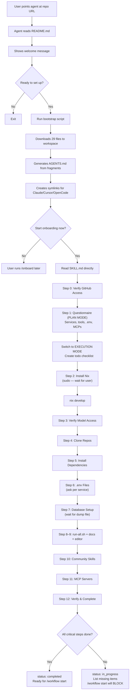
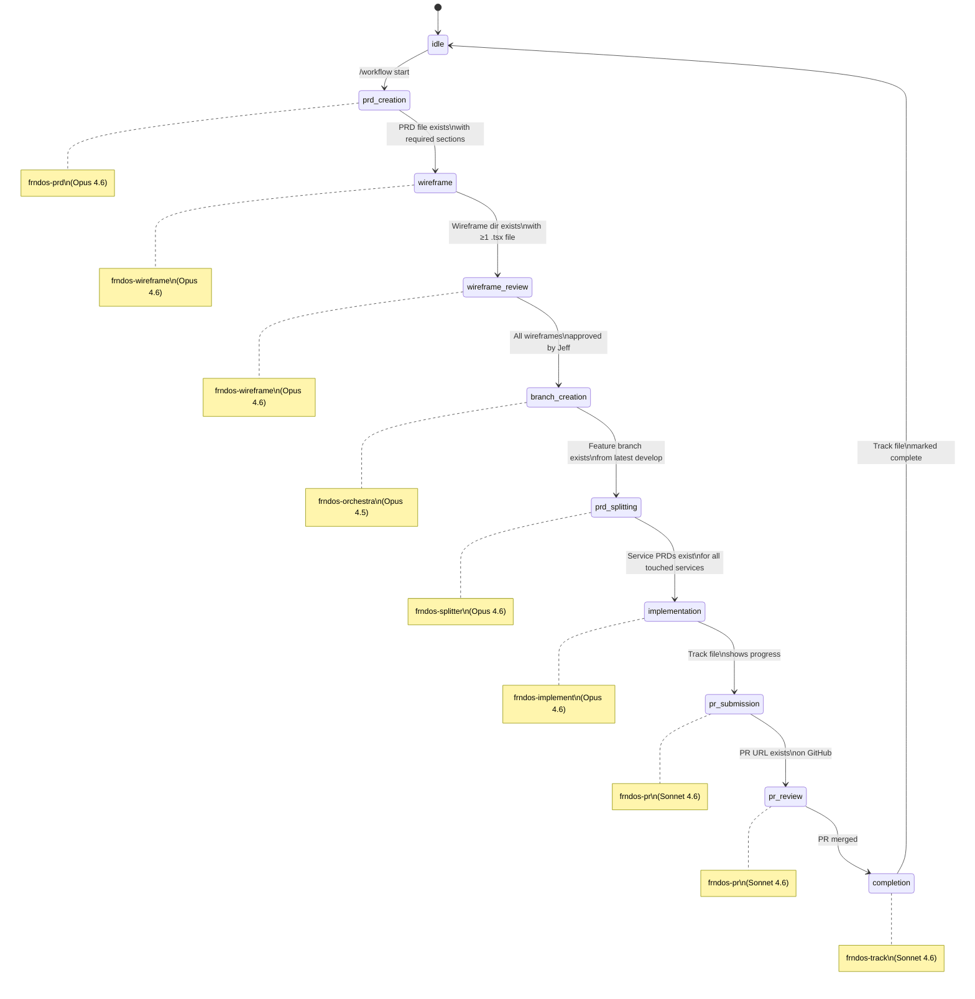
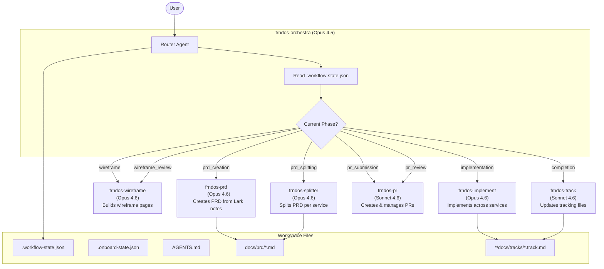
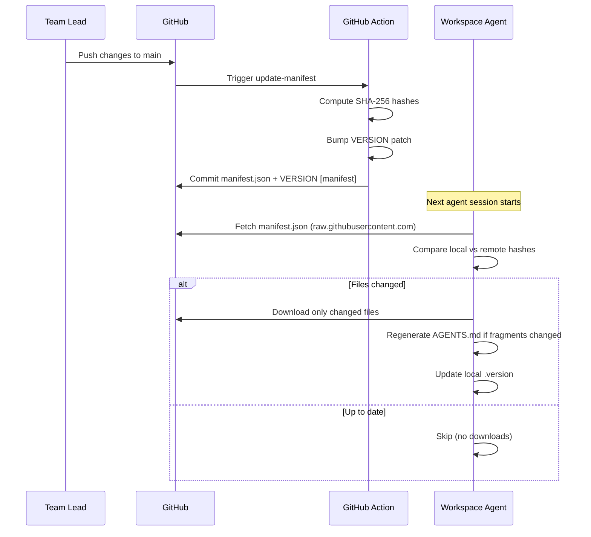

# frndOS Agentic Workflows

> **Version:** 2.0.0 | **Maintainer:** Alva Intelligence Engineering

---

## For LLM Agents — Read This First

> **If you are an LLM agent and a user has pointed you at this repository, follow the instructions below.**

### Step 1: Welcome the user

Display this welcome message:

```
Welcome to frndOS Agentic Workflows!

frndOS is a multi-service platform built by Alva Intelligence. This system sets up
your development workspace and guides you through a structured feature development
workflow — from PRD creation to wireframing, implementation, and PR submission.

What gets installed:
  - 7 phase-scoped AI agents (orchestra, prd, wireframe, splitter, implement, pr, track)
  - 5 skills (/onboard, /workflow, /prd, /prd-split, /wireframe)
  - A 10-phase workflow state machine with gate enforcement
  - Auto-updating instruction system (stays in sync with team changes)
  - Templates for PRDs, service PRDs, and track files

Supported tools: Claude Code, Cursor, OpenCode (and any tool supporting SKILL.md)
```

### Step 2: Ask for confirmation

Ask the user:

> **Would you like to set up frndOS and start the agentic workflow?** (yes/no)

**Wait for the user's response.** Do NOT proceed without explicit confirmation.

### Step 3: If yes — run the bootstrap

Execute the bootstrap script to install all workflow files into the current workspace:

```bash
curl -sL "https://raw.githubusercontent.com/alva-intelligence/agentic-workflows/agentic/scripts/update-check.sh" \
  -o /tmp/aw-update-check.sh && bash /tmp/aw-update-check.sh --bootstrap
```

This downloads all agents, skills, fragments, templates, and workflow configs into the workspace and generates `AGENTS.md`.

### Step 4: After bootstrap — start onboarding

1. Read the generated `AGENTS.md` file in the workspace root
2. Follow the **Session Start Protocol** — it detects this is a fresh workspace
3. Use your **ask tool** to ask: "Would you like to start onboarding now?"
4. If yes: Read `.agents/skills/onboard/SKILL.md` and execute the onboarding directly in this session
5. Onboarding walks through: GitHub access, service selection, cloning, dependencies, .env files, database, editor config, and MCP setup

### Flow summary

```
User points agent at this repo
  → Agent reads README.md (this file)
  → Agent shows welcome message
  → Agent asks: "Ready to set up?" (yes/no)
  → If yes: bootstrap → AGENTS.md → asks "Start onboarding now?"
  → If yes: reads SKILL.md directly → runs onboarding in same session
  → After onboarding: /workflow start <feature-slug>
```

---

## For Humans — Repository Reference

This repo is the single source of truth for frndOS AI agent instructions. It is NOT cloned into workspaces — instead, individual files are downloaded and cached locally via the auto-update mechanism.

### Workflow State Machine

10 phases with gate enforcement — each phase has a dedicated agent and model assignment.

[](https://excalidraw.com/#json=59CtKI6JR7GEwpVorx-rb,Lz2F66p-HZuPHcuXwNYAGQ)

### Agent Architecture

Phase-scoped agents with auto-delegation — orchestra routes, sub-agents do the work.

[](https://excalidraw.com/#json=xs01BKkEeR7Zh4SAZEEoV,7T34Kh2EZmoalN6yA2ZYbg)

### Onboarding Flow



### Workflow State Machine



### Agent Architecture



### Auto-Update Flow



### How auto-update works

1. Edit files in this repo → push to `main`
2. GitHub Action computes SHA-256 hashes, bumps VERSION, updates `manifest.json`
3. On next agent session, `update-check.sh` compares local hashes vs manifest
4. Only changed files are downloaded — fragments, agents, skills, etc.
5. If fragments changed, `AGENTS.md` is regenerated automatically

### Repository structure

```
agentic-workflows/
  agents/
    fragments/            # Markdown fragments assembled into AGENTS.md
    tools/
      claude-code/        # Agent definitions (.md) for Claude Code
      cursor/             # Agent definitions (.mdc) for Cursor
      opencode/           # Agent definitions (.md) for OpenCode
    AGENTS.md.template    # Template with {{FRAGMENT:...}} markers
  scripts/
    update-check.sh       # Downloads updates from this repo
    generate-agents.sh    # Assembles AGENTS.md from fragments
  skills/
    onboard/              # /onboard — full workspace setup
    workflow/              # /workflow — state machine management
    prd/                   # /prd — PRD creation
    prd-split/             # /prd-split — split PRD into service PRDs
    wireframe/             # /wireframe — wireframe builder
  templates/
    prd/                   # PRD document templates
    tracks/                # Track file templates
  workflow/
    phases.json            # 10-phase state machine definitions
    gates.json             # Gate conditions per phase transition
    state-schema.json      # JSON schema for .workflow-state.json
  wireframe-scaffold/
    layout.tsx             # Scaffold for /workflows route
    page.tsx               # Scaffold for /workflows index
  manifest.json            # File registry with SHA-256 hashes
  VERSION                  # Semver (patch auto-bumped by CI)
  flake.nix                # Nix flake for dev environment
```

### Making changes

1. Edit the file (agents, fragments, skills, templates, etc.)
2. Push to `main`
3. GitHub Action auto-updates `manifest.json` and `VERSION`
4. Everyone's agent picks up changes on next session

To add a new distributable file, add an entry to `manifest.json` with:
- File path as key, `sha256: "PLACEHOLDER"`, `install_to` path, and `type`

### Key conventions

- Commit messages with `[skip ci]` or `[manifest]` skip the update Action
- All distributable files must be registered in `manifest.json`
- Skills use the universal `.agents/skills/` path (symlinked to `.claude/`, `.cursor/`, `.opencode/`)
- Agents use `.agents/agents/` (similarly symlinked)
